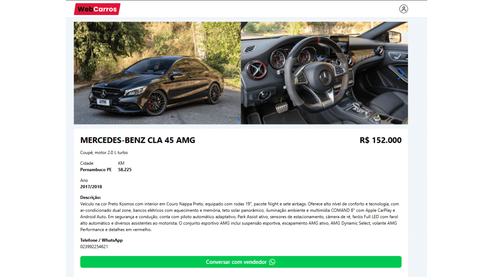

# WebCars


---

## Sobre o projeto

é um sistema de anúncios de carros novos e usados, desenvolvido com **React**, **TypeScript**, **TailwindCSS** e **Firebase**. O usuário pode se cadastrar, fazer login, cadastrar veículos com fotos e dados (modelo, ano, km, preço, cidade, WhatsApp) e visualizar todos os anúncios na home, com busca e detalhes de cada carro.O sistema possui **autenticação**, **rotas privadas** (painel e cadastro de carro apenas para usuários logados) e **interface responsiva** 

**Deploy**: 

---

## Layout

<p align="center">
  
</p>

<p align="center">
  
</p>

<p align="center">
  
</p>

---

## Tecnologias utilizadas

O projeto foi desenvolvido com as seguintes tecnologias:

- **React** — Biblioteca principal para interface  
- **TypeScript** — Tipagem estática e melhor manutenção  
- **TailwindCSS** — Estilização rápida e responsiva  
- **Firebase** — Autenticação, Firestore e Storage (fotos)  
- **Vite** — Ferramenta de build e servidor local  
- **React Router DOM** — Navegação e rotas  
- **React Hook Form** — Formulários e validação  
- **React Hot Toast** — Notificações  
- **Swiper** — Carrossel de imagens  

## Funcionalidades

- Login e cadastro com Firebase  
- Listagem de carros na home com busca  
- Visualização dos detalhes do carro  
- Painel do usuário (dashboard) com seus anúncios  
- Cadastro de carro com múltiplas imagens (Firebase Storage)  
- Edição e exclusão de anúncios pelo dono  
- Proteção de rotas (área restrita a usuários autenticados)  
- Interface totalmente responsiva  

---

## Como rodar o projeto

### Pré-requisitos

- [Node.js](https://nodejs.org/)
- [Git](https://git-scm.com/)
- Conta no [Firebase Console](https://console.firebase.google.com/)

---

### Clonando o repositório

```bash
git clone https://github.com/SEU_USUARIO/webcars.git
cd webcars
````

---

### Instalando dependências

```bash
npm install
```

---

### Variáveis de ambiente

Crie um arquivo `.env` na raiz do projeto
(use o `.env.example` como base):

```env
VITE_API_KEY=
VITE_AUTH_DOMAIN=
VITE_PROJECT_ID=
VITE_STORAGE_BUCKET=
VITE_MESSAGING_SENDER_ID=
VITE_APP_ID=
```

---

### ▶️ Executando o projeto

```bash
npm run dev
```

O projeto será iniciado em:

```
http://localhost:5173
```

---

## Contribuições & Observações

Fique à vontade para contribuir com o projeto!

* Siga as boas práticas de commits
* Crie Pull Requests com explicações claras

Projeto desenvolvido para fins de aprendizado e portfólio.
As informações e dados utilizados são apenas exemplos.

<p align="center">
  Feito por <b>João Vitor</b> 🖖
</p>
